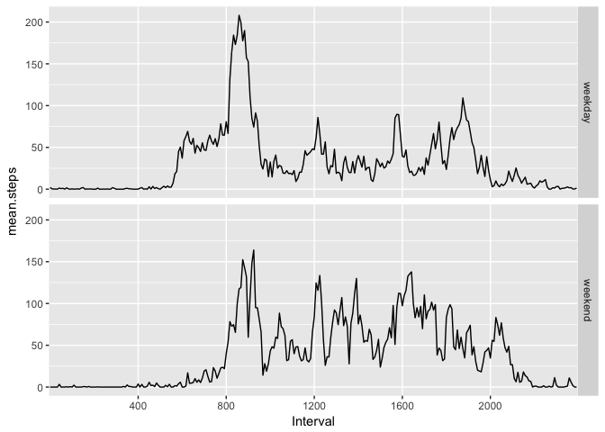

# Reproducible Research: Peer Assessment 1


## Loading and preprocessing the data
I will assume the zip file ("activity.zip") is already in the working directory.  Unzip it to "activity.csv",   read it in, and see what it looks like.


```r
unzip("activity.zip", "activity.csv")
activity <- read.csv("activity.csv")
head(activity)
```

```
##   steps       date interval
## 1    NA 2012-10-01        0
## 2    NA 2012-10-01        5
## 3    NA 2012-10-01       10
## 4    NA 2012-10-01       15
## 5    NA 2012-10-01       20
## 6    NA 2012-10-01       25
```

```r
str(activity)
```

```
## 'data.frame':	17568 obs. of  3 variables:
##  $ steps   : int  NA NA NA NA NA NA NA NA NA NA ...
##  $ date    : Factor w/ 61 levels "2012-10-01","2012-10-02",..: 1 1 1 1 1 1 1 1 1 1 ...
##  $ interval: int  0 5 10 15 20 25 30 35 40 45 ...
```

```r
summary(activity)
```

```
##      steps                date          interval     
##  Min.   :  0.00   2012-10-01:  288   Min.   :   0.0  
##  1st Qu.:  0.00   2012-10-02:  288   1st Qu.: 588.8  
##  Median :  0.00   2012-10-03:  288   Median :1177.5  
##  Mean   : 37.38   2012-10-04:  288   Mean   :1177.5  
##  3rd Qu.: 12.00   2012-10-05:  288   3rd Qu.:1766.2  
##  Max.   :806.00   2012-10-06:  288   Max.   :2355.0  
##  NA's   :2304     (Other)   :15840
```
As promised looks like 3 variables: steps, date and interval with 17568 observations.
Might need to change the date format.  The others look fine.  

There should be 12 intervals per hour X 24 hours per day so 288 intervals per day.
The maximum interval should be 24 x 60 = 1440.  Oh, I see, the "interval" label is in military time
showing the hours and minutes since midnight -- it ranges from 000 (or just "0") to 2355.

```r
activity$date <- as.Date(activity$date)
activity$interval <- as.factor(activity$interval)
```

## What is mean total number of steps taken per day?


```r
daily <- tapply(activity$steps, activity$date, sum)
print(paste("mean:", mean(daily, na.rm=TRUE)))
```

```
## [1] "mean: 10766.1886792453"
```

```r
print(paste("median:", median(daily, na.rm=TRUE)))
```

```
## [1] "median: 10765"
```

Over 10,000 steps per day.  Good job!

```r
hist(daily, breaks=20)
rug(daily)
```

<!-- -->


```r
barplot(daily)
```

<!-- -->

## What is the average daily activity pattern?

First a quick plot to get a sense of it:

```r
library(ggplot2)

g <- ggplot(activity, aes(x=interval,y=steps))
g + geom_point(na.rm=TRUE) + scale_x_discrete("Interval", c(400,800,1200,1600,2000))
```

<!-- -->

This shows steps per 5 minute interval throughout the day.  Because military time jumps from, e.g., from 1155 to 1200, there are gaps along the horizontal axis.  But this gives a reasonable sense of the typical activity level throughout the day.  Very little activity until about 0600 (6am) and trailing off again after about 2100 (9pm)

```r
library(plyr)
mean.steps.thru.day <- ddply(activity, .(interval), summarize, mean=mean(steps, na.rm=TRUE))
#plot(mean.steps.thru.day$interval, mean.steps.thru.day$mean, type="l")
library(ggplot2)
g <- ggplot(mean.steps.thru.day, aes(x=interval,y=mean))
g + geom_point(na.rm=TRUE) + scale_x_discrete("Interval", c(400,800,1200,1600,2000))
```

<!-- -->

```r
#qplot(interval, mean, data=mean.steps.thru.day, geom="line", group=1)
```

The above shows the average number of steps per 5 minute interval throughout the day.  


```r
mean.steps.thru.day$interval[mean.steps.thru.day$mean==max(mean.steps.thru.day$mean)]
```

```
## [1] 835
## 288 Levels: 0 5 10 15 20 25 30 35 40 45 50 55 100 105 110 115 120 ... 2355
```

Peak activity is during the 0835 interval (8:35am).

## Imputing missing values
Looks like some missing values for steps.  I wonder how many?

```r
mean(is.na(activity$steps))
```

```
## [1] 0.1311475
```
13% -- not bad.

I wouldn't expect any missing values for the other variables.

```r
mean(is.na(activity$date))
```

```
## [1] 0
```

```r
mean(is.na(activity$interval))
```

```
## [1] 0
```
None -- as expected.

I'd like to see where the missing data is.

```r
nas <- activity[is.na(activity$steps),-1]
nas$date <- as.Date(nas$date)
nas$interval <- as.factor(nas$interval)
plot(nas$date,nas$interval,pch=".")
```

<!-- -->

The above seems to indicate there are 8 whole days with no steps data at all.  Which days?

```r
unique(activity[is.na(activity$steps),]$date)
```

```
## [1] "2012-10-01" "2012-10-08" "2012-11-01" "2012-11-04" "2012-11-09"
## [6] "2012-11-10" "2012-11-14" "2012-11-30"
```

What days of the week are these?

```r
activity$wday <- as.POSIXlt(activity$date)$wday
as.POSIXlt(unique(activity[is.na(activity$steps),]$date))$wday
```

```
## [1] 1 1 4 0 5 6 3 5
```

Pretty evenly distributed across the days of the week.  

Since whole days are missing,
I think I'll try to impute the steps for the missing days by using the median of steps for
the same day of the week and same interval.

```r
median.steps.thru.day.by.wday <- ddply(activity, .(interval,wday), summarize, median.steps=median(steps, na.rm=TRUE))
```

This is clumsy, but here goes.  I'll replace all the steps values for each of the missing days by the median step values for the appropriate day of the week.

```r
imputed.activity <- activity
nulldates <- unique(activity[is.na(activity$steps),]$date)
for (i in 1:length(nulldates)) {
    date <- nulldates[i]
    imputed.activity$steps[imputed.activity$date==date] <- median.steps.thru.day.by.wday$median.steps[median.steps.thru.day.by.wday$wday==as.POSIXlt(date)$wday]
}
sum(is.na(imputed.activity$steps))
```

```
## [1] 0
```

After imputing...

```r
daily <- tapply(imputed.activity$steps, imputed.activity$date, sum)
print(paste("mean:", mean(daily, na.rm=TRUE)))
```

```
## [1] "mean: 9705.23770491803"
```

```r
print(paste("median:", median(daily, na.rm=TRUE)))
```

```
## [1] "median: 10395"
```

Both the mean and median are lower after imputing the missing data.  Good job!

```r
hist(daily, breaks=20)
rug(daily)
```

<!-- -->
## Are there differences in activity patterns between weekdays and weekends?

Let's take a look at the median steps per interval separated by day of the week.  0 = Sunday, 6 = Saturday.

```r
median.steps.thru.day.by.wday.imputed <- ddply( imputed.activity, .(interval,wday), summarize, median.steps=median(steps, na.rm=TRUE))

g <- ggplot(median.steps.thru.day.by.wday.imputed, aes(x=interval,y=median.steps))
g + geom_line(aes(group=wday)) + scale_x_discrete("Interval", c(400,800,1200,1600,2000)) + facet_grid(wday~.)
```

<!-- -->

```r
#qplot(interval, median.steps, data = median.steps.thru.day.by.wday.imputed, geom="line", group=1, facets=wday~.)
```

All days have heavy activity in the morning and evening.  Weekdays have little activity between 9am to 5pm.  But the weekends have more consistent activity throughout the day.


```r
imputed.activity$wend <- as.factor(ifelse(imputed.activity$wday %in% c(0,6), 'weekend', 'weekday'))
mean.steps.thru.day.by.wend.imputed <- ddply( imputed.activity, .(interval,wend), summarize, mean.steps=mean(steps, na.rm=TRUE))

g <- ggplot(mean.steps.thru.day.by.wend.imputed, aes(x=interval,y=mean.steps))
g + geom_line(aes(group=wend)) + scale_x_discrete("Interval", c(400,800,1200,1600,2000)) + facet_grid(wend~.)
```

<!-- -->

```r
#qplot(interval, mean.steps, data = mean.steps.thru.day.by.wend.imputed, geom="line", facets=wend~., group=1)
```
